# 项目依赖关系图（核心模块）

以下使用 Mermaid 展示核心层次关系（游戏逻辑 ← 控制器 ← UI 视图/组件）。

```mermaid
flowchart TD
  %% ================= Core / Systems =================
  subgraph Core[Core / Systems（核心/系统层）]
    Combatant[Combatant 基类（战斗单位）]
    Card[Card 卡片/随从]
    Inventory[Inventory 背包/物品栏]
    EquipmentSystem[EquipmentSystem 装备系统]
    Player[Player 玩家]
    ObservableList[ObservableList 可观察列表]
    Events[_EventBus 事件总线]
    DnD[CharacterSheet DnD人物卡]
  end

  %% ================= Game Modes =================
  subgraph Game[Game Modes（游戏模式/内容）]
    SimplePvEGame[SimplePvEGame 游戏逻辑]
    EnemyFactory[EnemyFactory 敌人工厂]
    ResourceFactory[ResourceFactory 资源工厂]
  end

  %% ================= Controller =================
  subgraph Controller[Controller（控制器）]
    SimplePvEController[SimplePvEController 文本控制器]
  end

  %% ================= UI (Tkinter) =================
  subgraph UI[UI（Tkinter）]
    GameTkApp[GameTkApp 主应用]
    EnemiesView[EnemiesView 敌人视图]
    AlliesView[AlliesView 队伍视图]
    ResourcesView[ResourcesView 资源视图]
    OperationsView[OperationsView 操作栏视图]
    LogPane[LogPane 日志面板]
    EquipmentDialog[EquipmentDialog 装备对话框]
    TargetPickerDialog[TargetPickerDialog 目标选择对话框]
    SelectionController[SelectionController 选择/高亮控制器]
    TargetingEngine[TargetingEngine 目标引擎]
  end

  %% -------- Core relations --------
  Card -->|继承/依赖| Combatant
  Player -->|拥有| Inventory
  EquipmentSystem -->|操作| Inventory
  SimplePvEGame -->|持有/操控| Player
  SimplePvEGame -->|维护| ObservableList
  Events -. 发布/订阅 .-> GameTkApp
  Events -. 发布/订阅 .-> EnemiesView
  Events -. 发布/订阅 .-> AlliesView

  %% -------- Game factories --------
  EnemyFactory -->|生成| SimplePvEGame
  ResourceFactory -->|生成| SimplePvEGame

  %% -------- Controller to game --------
  SimplePvEController -->|调用| SimplePvEGame

  %% -------- UI uses controller and game --------
  GameTkApp -->|持有| SimplePvEController
  GameTkApp -->|使用| LogPane
  GameTkApp -->|使用| TargetingEngine
  GameTkApp -->|使用| SelectionController
  EnemiesView -->|由...创建/挂载| GameTkApp
  AlliesView -->|由...创建/挂载| GameTkApp
  ResourcesView -->|由...创建/挂载| GameTkApp
  OperationsView -->|由...创建/挂载| GameTkApp
  EquipmentDialog -->|弹出自| GameTkApp
  TargetPickerDialog -->|弹出自| GameTkApp

  %% -------- Views draw from Game --------
  EnemiesView -->|读取/渲染| SimplePvEGame
  AlliesView -->|读取/渲染| SimplePvEGame
  ResourcesView -->|读取/渲染| SimplePvEGame
  OperationsView -->|读取控制器状态| SimplePvEController

  %% -------- Targeting --------
  TargetingEngine -->|回调/上下文| GameTkApp
  TargetingEngine -->|读取候选/状态| SimplePvEGame
```

说明：
- 实线 A --> B：A 依赖/使用/持有 B；虚线 A -.-> B：发布/订阅等松耦合关系。
- Core/Systems：通用数据结构、背包/装备、事件总线、DnD 角色卡等。
- Game Modes：具体游戏模式的逻辑与内容（敌人/资源的工厂）。
- Controller：面向命令行/文本的控制器；UI 仍复用其渲染与命令处理。
- UI：Tkinter 主应用、视图组件、对话框、目标与选择控制。
- TargetingEngine：目标选择状态机；SelectionController：统一管理选择/高亮，避免刷新丢失状态。
